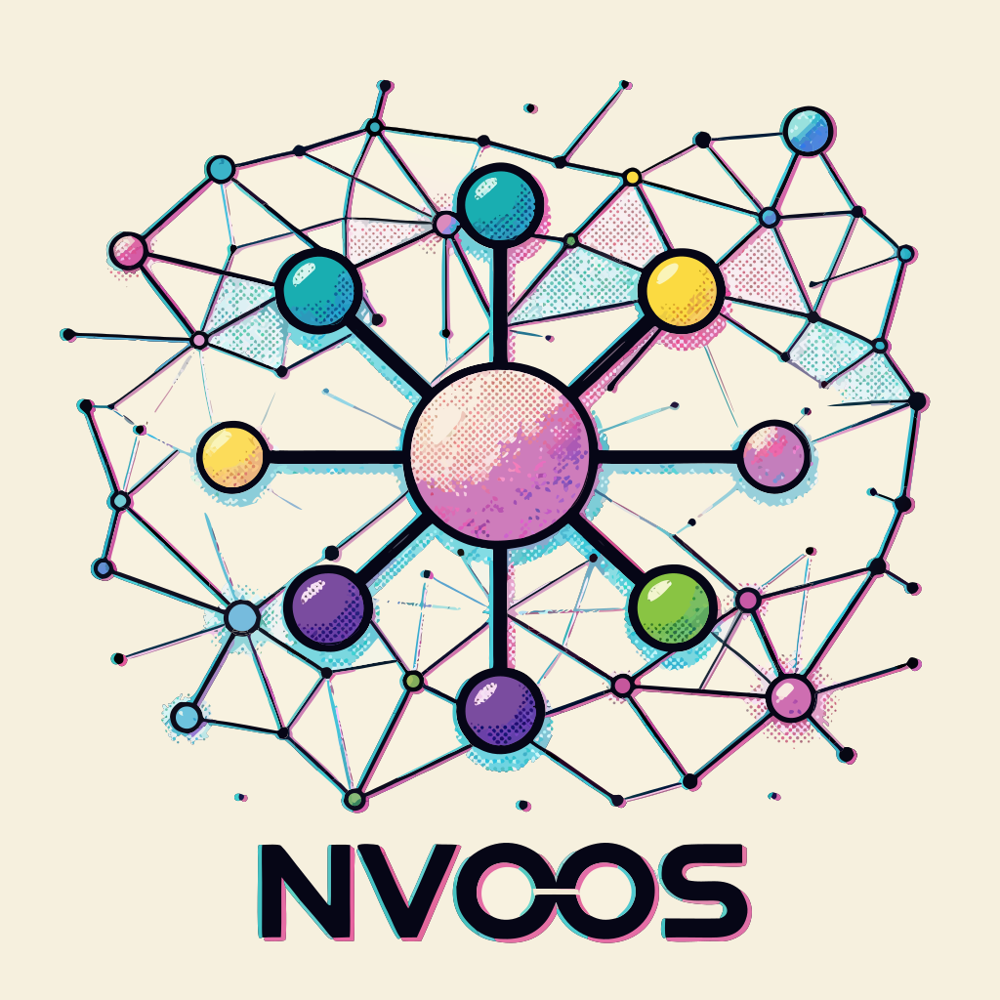

# NV oOS MCP Gateway
# ==================

<p align="center"></p>

A public, fleet-scoped **Model Context Protocol** endpoint for the
[NV oOS (Open Operator System)](https://github.com/nvdigitalsolutions/mcp-ai-wpoos)
WordPress platform. One API key, every bound site — tools appear namespaced
as `<site-slug>.<tool>`.

The gateway is an **MCP aggregating proxy** speaking streamable HTTP
(MCP 2026-07-28): it authenticates callers with a public API key, forwards
`initialize` / `tools/list` / `tools/call` to the bound NV oOS sites' native
`/wp-json/mcp-ai/v1/mcp` endpoints using Fleet Operator tokens, and keeps
the fleet surface collision-free by prefixing tool names per site.

Deployment target: **Cloudways Velocity** (managed Node hosting) at
`https://mcp.nvoos.pro`. See
[`docs/operations/deployment/mcp-gateway-velocity-setup.md`](../../docs/operations/deployment/mcp-gateway-velocity-setup.md).

> **One-way mirror:** this addon is the canonical source and is synced to
> the standalone repo `nvdigitalsolutions/nvoos-mcp-gateway` (branch `main`)
> by `sync-mcp-gateway.yml`, which snapshots the subtree as one commit per
> sync and pushes **without `--force`** — the mirror main stays a linear
> fast-forward line, so hosting platforms (Cloudways Velocity) auto-deploy
> on every sync. Never commit to the standalone repo directly — the next
> sync overwrites it.

---

## Endpoints

| Route | Auth | Purpose |
|-------|------|---------|
| `GET /mcp` | public | Streamable-HTTP discovery JSON |
| `POST /mcp` | Bearer key | JSON-RPC 2.0 (initialize, ping, notifications, tools/list, tools/call, resources/*, prompts/*) |
| `GET /health` | public | Minimal status + per-site health registry |
| `GET /health/full` | Bearer key | Full view (host-only URLs, bindings) |
| `GET /` | public | Human landing page (directory reviewers) |

## Configuration (env only)

| Variable | Required | Purpose |
|----------|----------|---------|
| `GATEWAY_PUBLIC_KEYS` | **yes** | Public keys → site slugs: `key=slug-a,slug-b;key2=slug-c` (or JSON object) |
| `GATEWAY_PUBLIC_KEYS_PREVIOUS` | no | Rotation overlap — previous key map (warns once on use) |
| `NVOOS_SITE_<SLUG>_URL` | per site | Upstream MCP endpoint, full URL incl. `/wp-json/mcp-ai/v1/mcp` |
| `NVOOS_SITE_<SLUG>_TOKEN` | per site | Fleet Operator token (`op_xxxx.SECRET`); never logged or returned |
| `AUTH_MODE` | no | `strict` (default) fails closed at boot when no keys are set |
| `UPSTREAM_TIMEOUT_MS` | no | Per-site timeout for tools/list + notifications (default 20000) |
| `UPSTREAM_TOOL_TIMEOUT_MS` | no | tools/call budget only — long-running tools get more room without slowing tools/list (default: `UPSTREAM_TIMEOUT_MS`) |
| `GATEWAY_OAUTH_ISSUER` | no | OAuth 2.1 authorization server issuer (e.g. Auth0 tenant). Setting it turns the gateway into an RFC 9728 protected resource — see the OAuth section below |
| `GATEWAY_OAUTH_JWKS_URI` | no | JWKS override (default: issuer's `/.well-known/jwks.json`) |
| `GATEWAY_OAUTH_RESOURCE` | no | RFC 8707 resource identifier / token audience (default `https://mcp.nvoos.pro`) |
| `TRUST_PROXY` | yes on Velocity | `1` — NGINX sets X-Forwarded-For |
| `ALLOWED_ORIGINS` | no | Comma-separated CORS origins for browser-based clients |
| `MAX_JSON_BODY` | no | Body limit (default `1mb`) |
| `RATE_LIMIT_GLOBAL` / `_MCP` / `_HEALTH` | no | Per-group budgets (defaults 600/5min, 120/min, 60/min) |

Slug → env suffix mapping: `site-a` → `NVOOS_SITE_SITE_A_*` (uppercase,
hyphens → underscores).

### Example

```env
GATEWAY_PUBLIC_KEYS=demo-public-key-1234567890=demo-site
NVOOS_SITE_DEMO_SITE_URL=https://demo.example.com/wp-json/mcp-ai/v1/mcp
NVOOS_SITE_DEMO_SITE_TOKEN=op_xxxx.SECRET
AUTH_MODE=strict
TRUST_PROXY=1
```

## Tool namespacing

- `tools/list` merges every site bound to the key and prefixes names:
  `site-a.create_post`, `site-b.woo_get_products`.
- `tools/call` accepts the prefixed name (always) or a bare name when the
  key is bound to exactly one site (passthrough mode).
- A failing upstream degrades the list to a `_meta.gateway.errors` entry
  instead of failing the whole call.
- v1 aggregation limitation: `resources/*` and `prompts/*` use the first
  bound site.

## Behavior & security

- Protocol negotiation: `initialize` echoes the highest protocol version both
  sides support (`2026-07-28` → `2024-11-05`), defaulting to `2024-11-05`
  when the client sends no version — strict clients (Zed, Claude Desktop)
  abort with "Unsupported protocol version" when the server hardcodes a
  version they do not speak.
- Stateless — no sessions, no SSE in v1 (the July 2026 spec revision makes
  stateless transport first-class).
- Fail-closed: no keys configured in strict mode → boot refuses; a key bound
  to no configured site → 503; unknown key → 401 with `WWW-Authenticate`.
- Rate limits are per public key (one noisy key cannot exhaust another's
  budget); upstream tokens are header-only and never appear in responses,
  logs, or errors.
- Auth: static API keys in v1; OAuth 2.1 (RFC 8414 + dynamic client
  registration) is the documented upgrade path.

## Claude Code plugin

The addon ships a Claude Code plugin (`.claude-plugin/plugin.json`,
`commands/connect.md`, `skills/gateway/`) that syncs to the mirror repo and
doubles as the marketplace source:

```
/plugin marketplace add nvdigitalsolutions/nvoos-mcp-gateway
```

Enabling the plugin prompts for the gateway API key (stored securely as a
sensitive `userConfig` option) and substitutes it into the MCP server's
`Authorization` header.

## OAuth 2.1 resource server (opt-in)

With `GATEWAY_OAUTH_ISSUER` set, the gateway acts as an RFC 9728 protected
resource **alongside** static keys:

- `GET /.well-known/oauth-protected-resource` (+ the `/mcp` path-insertion
  variant) serves the protected-resource metadata document (inert 404 when
  OAuth is unconfigured).
- 401 responses carry `WWW-Authenticate: Bearer resource_metadata="…",
  scope="…"` so MCP clients can run the OAuth 2.1 authorization-code + PKCE
  flow against the configured authorization server.
- JWT bearer tokens validate against the AS JWKS (cached, fail-closed):
  signature, `iss`, `aud` (RFC 8707 resource binding), `exp`/`nbf`, and
  scope.
- Site binding is scope-based: each `site:<slug>` scope grants access to
  that bound site (the read-only `site:read` scope is advertised for future
  fine-grained enforcement). Tokens granting no configured site get 403
  `insufficient_scope`.
- Upstream proxying is unchanged: the gateway always exchanges for the
  site's own Fleet Operator token — OAuth tokens are never forwarded
  upstream (no confused-deputy passthrough).

Authorization server: any OAuth 2.1 AS with RFC 8414 metadata + JWKS
(Auth0 is the platform convention). Dynamic client registration (RFC 7591)
belongs to the AS, not the gateway.

## Development

```bash
npm install
npm test        # node:test suites — fake upstreams, no infrastructure
npm run dev     # node --watch src/index.js
```

Local smoke test against the docker compose dev site:

```bash
GATEWAY_PUBLIC_KEYS="dev-key-1234567890abcd=docker" \
NVOOS_SITE_DOCKER_URL="http://localhost:8000/wp-json/mcp-ai/v1/mcp" \
NVOOS_SITE_DOCKER_TOKEN="<assistant/operator token>" \
PORT=8899 npm start
# → curl http://127.0.0.1:8899/mcp
```

## Ecosystem discovery

The public endpoint `https://mcp.nvoos.pro/mcp` is listed in the **official
MCP Registry** (`registry.modelcontextprotocol.io`) as
`io.github.nvdigitalsolutions/nvoos-mcp-gateway` — a streamable-HTTP remote
with a required `Authorization` header. The registry metadata lives in
[`server.json`](./server.json) and is published with the `mcp-publisher`
CLI. Community directories (mcpservers.org, mcp.directory, PulseMCP, Glama)
carry entries that point back here; the `GET /` landing page is the
directory-reviewer surface.

## License

GPL-3.0-or-later — see the repository LICENSE.
